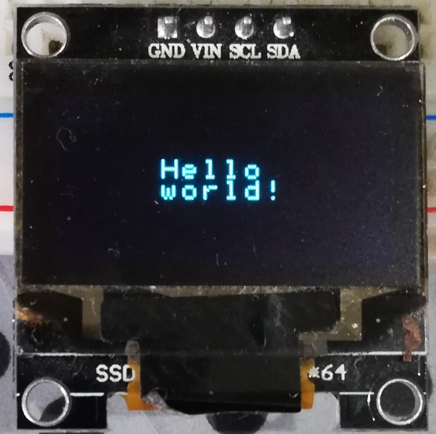

# LVGL project for ESP32

This is an ESP32 demo project showcasing LVGL v7 with support for several display controllers and touch controllers.
The demo application is the demo_widgets project from the [lv_examples](https://github.com/lvgl/lv_examples) repository.

Version of LVGL used: 7.9.
Version of lv_examples used: 7.9.

Notes:

[Use LVGL in your ESP-IDF project](#Use-LVGL-in-your-ESP-IDF-project)

[Use lvgl_esp32_drivers in your project](#Use-lvgl_esp32_drivers-in-your-project)

[Platformio support](#Platformio-support)


Monochrome support:



# Display and touch controllers

The display and touch (indev) controllers are now into it's own repository, you can find it [here](https://github.com/lvgl/lvgl_esp32_drivers).
To report any issue or add new display or touch (indev) drivers you can do so in the `lvgl_esp32_drivers` repo.

## Supported display controllers

**NOTE:** You now need to set the display horizontal and vertical size, color depth and Swap the 2 bytes of RGB565 color on the LVGL configuration menuconfig (it's no longer handled automatically).

This will allow to add more color depths when the display controller supports them.

| Display Controller                          | Type       | Interface              | Color depth (LV_COLOR_DEPTH) | Swap the 2 bytes of RGB565 color (LV_COLOR_16_SWAP) |
|---------------------------------------------|------------|------------------------|------------------------------|-----------------------------------------------------|
| ILI9341                                     | TFT        | SPI                    | 16: RGB565                   | Yes                                                 |
| ILI9486                                     | TFT        | SPI                    | 16: RGB565                   | Yes                                                 |
| ILI9488                                     | TFT        | SPI                    | 16: RGB565                   | No                                                  |
| HX8357B/HX8357D                             | TFT        | SPI                    | 16: RGB565                   | Yes                                                 |
| ST7789                                      | TFT        | SPI                    | 16: RGB565                   | Yes                                                 |
| ST7735S                                     | TFT        | SPI                    | 16: RGB565                   | Yes                                                 |
| FT81x                                       | TFT        | Single, Dual, Quad SPI | 16: RGB565                   | No                                                  |
| GC9A01                                      | TFT        | SPI                    | 16: RGB565                   | Yes                                                 |
| RA8875                                      | TFT        | SPI                    | 16: RGB565                   | Yes                                                 |
| SH1107                                      | Monochrome | SPI                    | 1: 1byte per pixel           | No                                                  |
| SSD1306                                     | Monochrome | I2C                    | 1: 1byte per pixel           | No                                                  |
| IL3820                                      | e-Paper    | SPI                    | 1: 1byte per pixel           | No                                                  |
| UC8151D/ GoodDisplay GDEW0154M10 DES        | e-Paper    | SPI                    | 1: 1byte per pixel           | No                                                  |
| FitiPower JD79653A/ GoodDisplay GDEW0154M09 | e-Paper    | SPI                    | 1: 1byte per pixel           | No                                                  |

## Supported touchscreen controllers:

- XPT2046
- FT3236
- other FT6X36 or the FT6206 controllers should work as well (not tested)
- STMPE610
- FT81x (Single, Dual, and Quad SPI)

If your display controller is not supported consider contributing to this repo by
adding support to it! [Contribute controller support](CONTRIBUTE_CONTROLLER_SUPPORT.md)

## Get started

### Prerequisites

- ESP-IDF Framework.

Note:

This project tries to be compatible with both the ESP-IDF v3.x and v4.0, but using the v4.0 is recommended.
Instructions here are given for the v4.x toolchain using `idf.py`, but it is easy to translate to make.
For example instead of running `idf.py menuconfig`, just run `make menuconfig`.

When using the ESP-IDF v3.x framework you must use `make` to build the project!.

### Build and run the demo.

Try this first to make sure your hardware is supported, wired and configured properly.

1. Get this project: `git clone --recurse-submodules https://github.com/lvgl/lv_port_esp32.git`

2. Get into the `lv_port_esp32` directory.

3. Run `idf.py menuconfig`

4. Configure LVGL in `Components config->LVGL Configuration`. For monochrome displays we suggest enabling the `unscii 8` font (Component config -> LVGL configuration -> FONT USAGE) and the MONO theme (Component config -> LVGL configuration -> THEME USAGE).

5. Configure your display and/or touch controllers in `Components config->LVGL TFT Display Configuration` and `Components config->LVGL TOUCH Configuration`.

6. Store your project configuration.

7. Build the project with `idf.py build`

8. If the build don't throw any errors, flash the demo with `idf.py -p (YOUR SERIAL PORT) flash` (with make this is just `make flash` - in 3.x PORT is configured in `menuconfig`)

### Support for development kits with embedded TFT displays.

Several ESP32 evaluation kits are supported via preconfigurations.

- ESP Wrover Kit v4.1
- M5Stack
- M5Stick
- M5StickC
- Adafruit 3.5 Featherwing
- RPi MPI3501
- Wemos Lolin OLED
- ER-TFT035-6
- AIRcable ATAGv3

## Use LVGL in your ESP-IDF project

LVGL now includes a Kconfig file which is used to configure most of the LVGL configuration options via menuconfig, so it's not necessary to use a custom `lv_conf.h` file.

It is recommended to add LVGL as a submodule in your IDF project's git repo.

From your project root directory:

1. Create a directory named `components` (if you don't have one already) with `mkdir -p components`.
2. Clone the lvgl repository inside the `components` directory with `git submodule add https://github.com/lvgl/lvgl.git components/lvgl`
3. Run `idf.py menuconfig`, go to `Component config` then `LVGL configuration` to configure LVGL.

## Use lvgl_esp32_drivers in your project

It is recommended to add lvgl_esp32_drivers as a submodule in your IDF project's git repo.

From your project root directory:

1. Create a directory named `components` (if you don't have one already) with `mkdir -p components`.
2. Clone the lvgl_esp32_drivers repository inside the `components` directory with `git submodule add https://github.com/lvgl/lvgl_esp32_drivers.git components/lvgl_esp32_drivers`
3. Run `idf.py menuconfig`, go to `Component config` then `LVGL TFT configuration` and `LVGL TFT Display configuration` to configure lvgl_esp32_drivers.

## Platformio support

Using the [lv_platformio](https://github.com/lvgl/lv_platformio) project add the following lines to `platformio.ini` file:

```
[env:esp32]
platform = espressif32
framework = espidf
board = esp-wrover-kit
```

Change the default environment to `default_envs = esp32`.

Modify the `main.c` like this:

```c
#include "lvgl.h"

// #include "driver.h"

#include "demo.h"

int app_main(void)
{
    lv_init();

    /* Initialize your hardware. */
    
    /* hw_init(); */

    demo_create();

    /* Create the UI or start a task for it.
     * In the end, don't forget to call `lv_task_handler` in a loop. */

    /* hw_loop(); */

    return 0;
```

For more information see: [platformio with espidf framework compability](https://github.com/lvgl/lv_port_esp32/issues/168).
