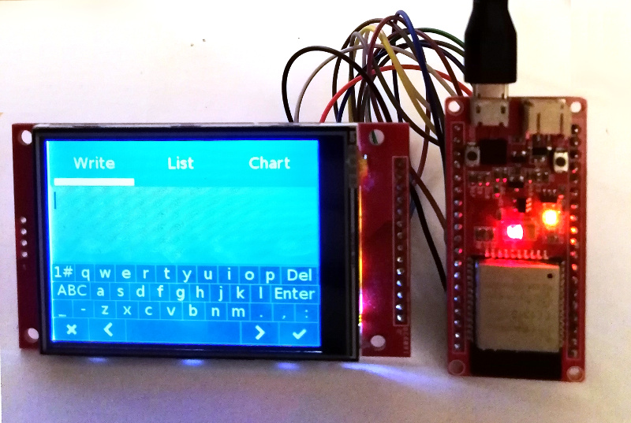

# LittlevGL project for ESP32


## Get started 
### Install the ESP32 SDK
1. Install ESP-IDF: http://esp-idf.readthedocs.io/en/latest/
2. Get this projects: `git clone --recurse-submodules https://github.com/littlevgl/esp32_ili9341.git`

### Add LittlevGL to the build
To link LittlevGL (lvgl) and lv_examples with ESP-IDF you need to add a **component.mk** file to each directory.

Espressif recommends to add third party software into a directory named **components**, so `lvgl` and `lv_examples` directories are located in a directory named **components**.

Next to this README file you find two component.mk template files:
- lvgl_component.mk
- lv_example_component.mk

Rename `lvgl_component.mk` to `component.mk` and move it to the `lvgl` directory, then rename `lv_example_component.mk` to `component.mk` and move it to the `lv_examples` directory, remember `lvgl` and `lv_examples` directories are located into the **components** directory.

### Configuration options
Some displays doesn't support the same options, for example, the ESP-Wrover-Kit doesn't have the touch controller and this is usual on other ILI9341 displays.

#### Touch controller
To configure the support for the touch controller go to `components/drv/component.mk` and change the value of `TOUCH_SUPPORT`. To enable the support for touch, set `TOUCH_SUPPORT=1`, like so `CFLAGS+=-DTOUCH_SUPPORT=1`, to disable set `TOUCH_SUPPORT=0`, like so `CFLAGS+=-DTOUCH_SUPPORT=0`.

#### TFT Display backlight level
Some displays turn on the backlight of the display with a logic 1, other with a logic 0, to set the correct value for your display go to `components/drv/component.mk` and change the value of `ILI9341_BCLK_ACTIVE_LVL`. For example, if your display turn on the backlight with a logic 0 set `CFLAGS+= -DILI9341_BCKL_ACTIVE_LVL=0`, if your display turn on the backlight with a logic 1 set `CFLAGS+= -DILI9341_BCKL_ACTIVE_LVL=1`.

#### Display size
You can change the size of your display in `lv_conf.h` in `LV_HOR\VER_RES_MAX`.

### Assign the correct pinout depending on your ESP32 dev board
There are several development boards based on the ESP32 chip, make sure you assign the correct pin numbers to the signals that interface with the TFT display board, below are some examples:

## Predefined Display Configurations

For development kits that come with a display already attached, all the correct settings are already known and can be selected in `menuconfig` from the first option "Select predefined display configuration." Once selected all the other options will be defaulted and won't appear in the menu.

Boards we currently have defined this way are:

### ESP-Wrover-Kit v4.1


This board comes with an embedded TFT screen with the **ILI9341** display driver and it doesn't have touch screen. The screen size is 320 x 240 px.

### M5Stack


This board comes with an embedded TFT screen with the **ILI9341** display driver and it doesn't have touch screen. The screen size is 240 x 320px.

## Predefined Board Pinouts

When wiring the display and touchpad (if applicable) it is best to use the board's designated HSPI and VSPI pins to take advantage of the hardware SPI support. Several board configurations are available; select the appropriate board in the "Select predefined board pinouts" menu in `menuconfig` and then wire the display and touchpad accordingly.

## ESP32 Dev Board with 38 GPIOs



### ILI9341 - HSPI
<table>
  <tr>
    <th>MOSI</th>
    <th>CLK</th>
    <th>CS</th>
    <th>DC</th>
    <th>RST</th>
    <th>BCKL</th>
  </tr>
  <tr>
    <td>13</td>
    <td>14</td>
    <td>5</td>
    <td>19</td>
    <td>18</td>
    <td>23</td>
  </tr>
</table>

### XPT2046 - VSPI

<table>
  <tr>
    <th>MOSI</th>
    <th>MISO</th>
    <th>CLK</th>
    <th>CS</th>
    <th>IRQ</th>
  </tr>
  <tr>
    <td>32</td>
    <td>35</td>
    <td>26</td>
    <td>33</td>
    <td>25</td>
  </tr>
</table>

## ESP32 DevKit v1 with 30 GPIOS

There is another development kit with only 30 GPIOs available:


### ILI9341

For ILI9341 HSPI is used, modify the pin configuration in `components/drv/disp_spi.h` to:

### ILI9341 - HSPI
<table>
  <tr>
    <th>MOSI</th>
    <th>CLK</th>
    <th>CS</th>
    <th>DC</th>
    <th>RST</th>
    <th>BCKL</th>
  </tr>
  <tr>
    <td>13</td>
    <td>14</td>
    <td>15</td>
    <td>2</td>
    <td>4</td>
    <td>21</td>
  </tr>
</table>

### XPT2046 - VSPI

<table>
  <tr>
    <th>MOSI</th>
    <th>MISO</th>
    <th>CLK</th>
    <th>CS</th>
    <th>IRQ</th>
  </tr>
  <tr>
    <td>23</td>
    <td>19</td>
    <td>18</td>
    <td>5</td>
    <td>25</td>
  </tr>
</table>

## ESP32 DevKit v4 with 38 GPIOS

See this pdf for further information: https://www.espressif.com/sites/default/files/documentation/esp32-wroom-32d_esp32-wroom-32u_datasheet_en.pdf

### ILI9341

For ILI9341 HSPI is used, modify the pin configuration in `components/drv/disp_spi.h` to:

```c
#define DISP_SPI_MOSI 13
#define DISP_SPI_CLK  14
#define DISP_SPI_CS   15
```

and `components/drv/ili9341.h` to:
```c
#define ILI9341_DC   17
#define ILI9341_RST  25
#define ILI9341_BCKL 26
```

### ILI9341 - HSPI
<table>
<tr>
<th>MOSI</th>
<th>CLK</th>
<th>CS</th>
<th>DC</th>
<th>RST</th>
<th>BCKL</th>
</tr>
<tr>
<td>13</td>
<td>14</td>
<td>15</td>
<td>17</td>
<td>25</td>
<td>26</td>
</tr>
</table>

### XPT2046 - VSPI

<table>
<tr>
<th>MOSI</th>
<th>MISO</th>
<th>CLK</th>
<th>CS</th>
<th>IRQ</th>
</tr>
<tr>
<td>23</td>
<td>19</td>
<td>18</td>
<td>5</td>
<td>27</td>
</tr>
</table>

For correct x/y coordinates, modify the min and max configuration in `components/drv/xpt2046.h` to:

```c
#define XPT2046_X_MIN  0
#define XPT2046_Y_MIN  0
#define XPT2046_X_MAX  4095
#define XPT2046_Y_MAX  4095
```

## Other Boards

Of course, all the individual pins can be configured in `menuconfig` if the available prefines don't match your board or project requirements. By default the prefined options are disabled and pin settings for the 30 pin dev board are defaulted.

### Flash to ESP32
1. Go to the project's directory: `cd esp32_ili9431`
2. Build the project: `make`
3. Upload the application to your board: `make flash`
