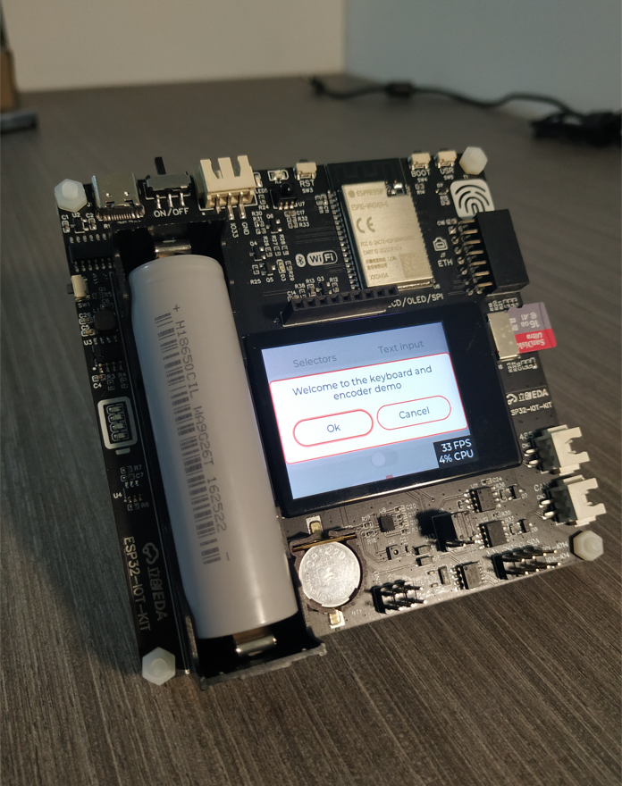
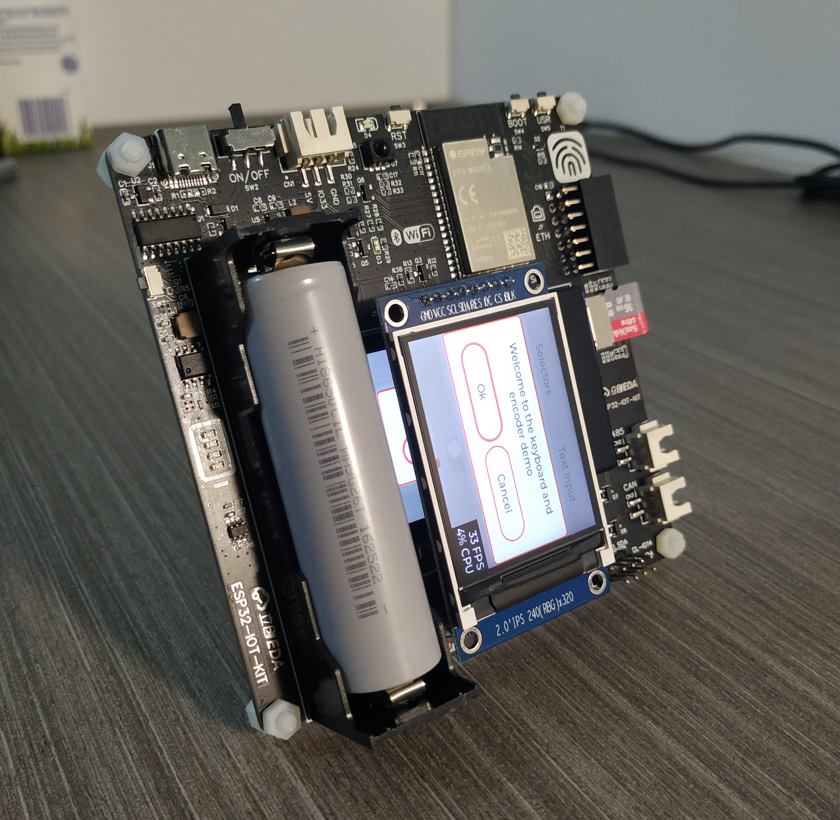
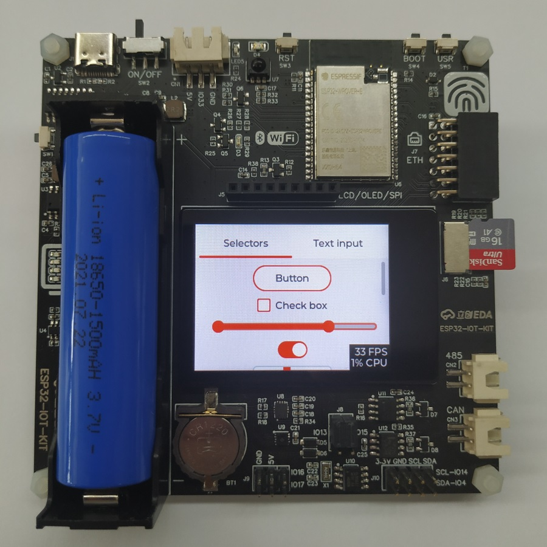

# LVGL project for ESP32-IOT-KIT

This is an ESP32 demo project showcasing LVGL v7 with support for several display controllers and touch controllers.

此工程fork自 [lvgl/lv_port_esp32](https://github.com/lvgl/lv_port_esp32)

修改了 `sdkconfig`，以适配`ESP32-IOT-KIT`开发板的 `ST7789V + FT6236U` 单点电容屏。

- Version of ESP-IDF required 4.2. 

- Version of LVGL used: 7.9.

***

## 如何使用

1. 递归clone本代码：
```
git clone --recurse-submodules https://github.com/ZhiliangMa/lv_port_esp32.git
```

2. 确保电脑已有 `ESP-IDF V4.2` 环境，`cd` 移动到工程目录。

3. 编译
```
idf.py build
```

4. 下载烧录
```
idf.py flash
```

即可在液晶屏上看到下图显示。

电容触摸屏可用，可进行拖拽、滑动操作，开发板配套的`FT6236U` 为单点电容屏。



<br/>

同时开发板允许使用上方的 `J5`接口，去插接额外的LCD模组。



<br/>

运行正视图。



***

## Demo演示和帧率

此工程自带4个Demo，可通过图形化设置项去选择运行。

`Component config` >> `lv_examples configuration` >> `Select the demo you want to run`

分别为：
- Show demo widgets。控件演示，使能`Set IRAM as LV_ATTRIBUTE_FAST_MEM`后，320x240分辨率，帧率约为20FPS。

- Demonstrate the usage of encoder and keyboard。可以很好的演示触摸屏和一些拖拽控件，无动作时满帧，有拖动动作时不算特别流畅。

- Benchmark your system。跑分，测试系统刷图成绩。

- Stress test for LVGL。压力测试，帧率抖动明显。


***

## `ESP32-IOT-KIT` 开发板硬件资源

- ADC * 2（电池、光照强度。电源可程控）
- 按键 * 4（BOOT、用户按键。还有两个是 复位 和 电池电量指示）
- 触摸按键 * 1
- 用户 LED * 1（同IO扩展 WS2812B灯带）
- 38KHz 红外接收、发射
- RS485、CAN（同IO复用，也可复用为UART等使用）
- I2C外设 * 4（ICM-20600六轴惯性IMU、SHT30温湿度、PCF8563 - RTC，还有在背部的电容触摸屏FPC座）
- 2.0寸单点电容触摸屏（320*240分辨率。液晶屏使用SPI、电容触摸I2C）
- **扩展**：LCD/OLED/SPI 扩展接口。I2C扩展接口。3.3/5V电源扩展接口。
- TF卡接口（SPI）。
- 以太网扩展接口。（可插接 LAN8720 有线以太网模组）
- TypeC 供电、下载、调试接口。
- 板载CH340自动下载电路，最高波特率为 2Mbps。
- 板载18650电池座，和充放电电源管理芯片，仅用板载电池即可提供3.3V和5V的2A电源输出。且3.3V电压轨为UPS，可保持板载硬件的不断电运行。

***

## 注意事项

- `ESP-IDF` 环境建议使用 `V4.2.2`。

- 工程设置项的`SPI`刷屏速率为 `40MHz`，以确保绝大多数使用者可以无误运行此demo。

- 如需修改`SPI`刷屏速率，请参考我的博客 [ESP32+st7789/ili9341运行LVGL例程](https://blog.csdn.net/Mark_md/article/details/120343727?spm=1001.2014.3001.5501)。

- 开发板配套的 `ST7789V + FT6236U` 单点电容屏模组，支持最大 `80MHz` 的SPI速率。但配置为`80MHz`时可能会出现轻微花屏，此时建议将TF卡插入右侧TF卡槽中，即可解决绝大多数问题，实现完美刷屏。

***

## `Easyio` 库推荐

&emsp;&emsp;`Easyio` 是一款适配于`ESP-IDF`框架的`开源驱动库`，以支持`ESP32`的简便开发。其目的是在保持官方SDK灵活性的同时，大幅度简化乐鑫`ESP-IDF`开发框架的使用难度。（方便的话，有开源的Arduino和Platform可以用，但在工作上有时会硬性要求使用`ESP-IDF`，毕竟要对接FAE，于是就萌生了搞个 `Easyio` 的想法）

&emsp;&emsp;`Easyio` 已对 `ESP32-IOT-KIT` 开发板进行了全面支持，可用Demo达50多个。更多信息请前往我的`Github`或`CSDN博客`。

&emsp;&emsp;[Easyio lib - Github](https://github.com/ZhiliangMa/easyio-lib-for-esp32)

&emsp;&emsp;[Easyio驱动库 - CSDN](https://blog.csdn.net/Mark_md/article/details/120157812?spm=1001.2014.3001.5501)
